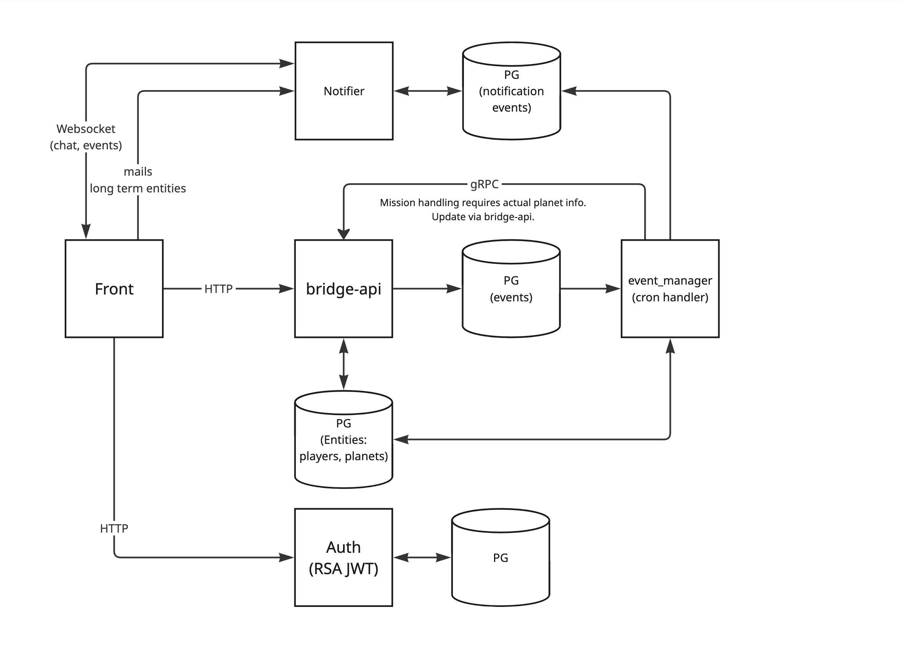

# Bridge API

- [Overview](#overview)
- [Architecture](#architecture)

## Overview
Bridge-API s the main public API for the game, handling operations related to players, planets, research, and fleets. In the current MVP, services communicate via a shared PostgreSQL database for simplicity, with plans to introduce dedicated IPC mechanisms later.

## Architecture
Top level architecture is present on the diagram. 

