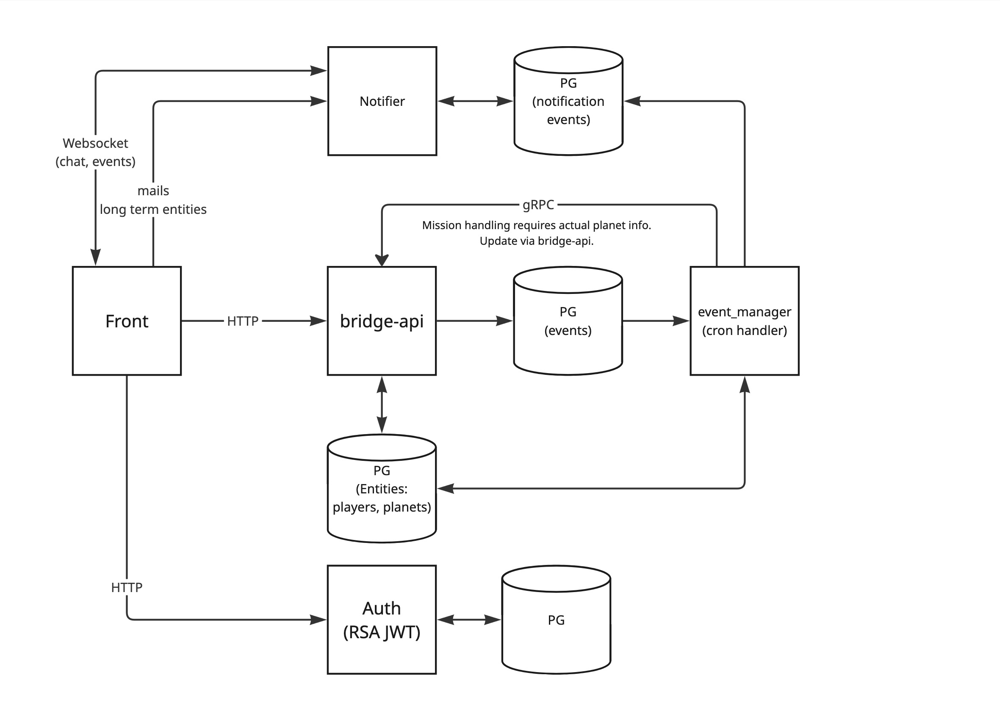

# Bridge API

- [Overview](#overview)
- [Architecture](#architecture)
- [Development](#development)
- [Env](#env)

## Overview
Bridge-API s the main public API for the game, handling operations related to players, planets, research, and fleets. In the current MVP, services communicate via a shared PostgreSQL database for simplicity, with plans to introduce dedicated IPC mechanisms later.

## Architecture
Top level architecture is present on the diagram. 

Alongside its public HTTP server, bridge-api exposes an internal gRPC server that will not be accessible outside the k8s cluster. Other services consume business logic from bridge-api over gRPC, as it is the master service for this functionality.

## Development
To start working with the server, set up the Postgres database by applying migrations from [galaxy-empire-team/migrations](https://github.com/galaxy-empire-team/migrations). After installing the migrations, launch the project using the variables listed below.

Once the server is running, you can explore its API using the provided [galaxy-empire-team/bruno-collection](https://github.com/galaxy-empire-team/bruno-collection).

## Env
An example of environment variables required by an API:
```
// Optional variables
APP_LOG_LEVEL=info
APP_LOG_FORMAT=json

// Required variables
HTTP_ENDPOINT=localhost:8000
GRPC_ENDPOINT=localhost:8001

PG_HOST=localhost
PG_PORT=7433
PG_USERNAME=bormon
PG_PASSWORD=postgres_password
PG_DB_NAME=ge
```